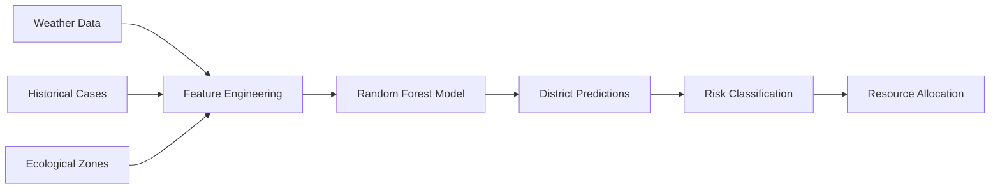

<p align="center">
  
</p>

<h1 align="center">🛡️ DengueGuard AI</h1>

<p align="center">
  <strong>National-Scale Dengue Prediction Framework for Sri Lanka</strong>
</p>

<p align="center">
  <a href="#features"></a>
  <a href="#model"></a>
  <a href="#license"></a>
  <a href="#status"></a>
</p>

<p align="center">
  
  
  
  
</p>

---

## 🌟 Overview

**DengueGuard AI** is an advanced machine learning system that predicts dengue fever outbreaks across all **25 districts of Sri Lanka**. The framework integrates real-time weather data, historical case patterns, and ecological zone modeling to provide actionable early warnings for public health authorities.


### 🎯 Key Capabilities

- **🔮 2-Week Forecast** — Predict dengue cases with epidemiological t-2 lag modeling
- **🗺️ 25-District Coverage** — Full national deployment across all Sri Lankan districts
- **🌦️ Weather Integration** — Real-time OpenMeteo API with 14-day historical analysis
- **🏥 Resource Planning** — Auto-calculate hospital beds, blood units, and test kits needed
- **🤖 AI Chat Assistant** — Interactive epidemiological analyst for deep-dive insights
- **📊 Risk Classification** — Dynamic thresholds aligned with WHO AA protocols

---

## 🚀 Quick Start

### Prerequisites

- Python 3.9 or higher
- pip package manager

### Installation

```bash
# Clone the repository
git clone https://github.com/yourusername/dengue-agent-sl.git
cd dengue-agent-sl

# Create virtual environment
python -m venv .venv
source .venv/bin/activate  # On Windows: .venv\Scripts\activate

# Install dependencies
pip install -r requirements.txt
```

### Run the Dashboard

```bash
cd dengue_pipeline/dashboard
streamlit run app.py
```

The dashboard will open at `http://localhost:8501`

### Docker Deployment

```bash
# Build and run with Docker Compose
docker-compose up -d

# Access at http://localhost:8501
```

---

## 🏗️ Project Structure

```
dengue-agent-sl/
├── 📂 dengue_pipeline/
│   ├── 📂 dashboard/          # Streamlit web application
│   │   └── app.py             # Main dashboard (DengueGuard AI UI)
│   ├── 📂 scripts/            # ML pipeline scripts
│   │   ├── train_model.py     # Model training pipeline
│   │   ├── generate_forecast.py
│   │   ├── fetch_weather.py   # OpenMeteo API integration
│   │   └── audit_model.py     # Model performance auditing
│   ├── 📂 data_raw/           # Raw weather & case data
│   ├── 📂 data_processed/     # Processed forecasts
│   ├── 📂 models/             # Trained ML models
│   └── 📂 config/             # Configuration files
├── 📂 scripts/                # Deployment & automation
│   ├── deploy_azure.sh        # Azure deployment script
│   ├── weekly_update.sh       # Automated weekly pipeline
│   └── crontab                # Scheduled job configuration
├── 📄 Dockerfile              # Container configuration
├── 📄 docker-compose.yml      # Multi-service orchestration
├── 📄 requirements.txt        # Python dependencies
└── 📄 README.md               # You are here!
```

---

## 🔬 Model Architecture

### Pooled National Framework

The model uses a **Pooled National Architecture** where all 25 districts are trained together, enabling cross-district learning while maintaining local accuracy.



### Ecological Zone Clustering

| Zone | Districts | Primary Driver |
|------|-----------|----------------|
| 🌧️ **Wet Zone** | Colombo, Gampaha, Kalutara, Galle, Matara | Rainfall Intensity |
| ☀️ **Dry Zone** | Jaffna, Trincomalee, Batticaloa, Anuradhapura | Humidity × Storage |
| 🏔️ **Hill Country** | Kandy, Nuwara Eliya, Badulla | Temperature Thresholds |

### Feature Engineering (50+ Features)

| Category | Features |
|----------|----------|
| **Weather** | Rainfall, Temperature, Humidity (current + 4 lags) |
| **Temporal** | Case lags (1-4 weeks), Seasonal encoding |
| **Spatial** | Neighbor cases, District encoding |
| **Composite** | Eco-suitability index, Case velocity, Rain-humidity interaction |

---

## 📊 Risk Classification Protocol

Dynamic thresholds based on **standard deviations** from historical district means:

| Risk Level | Threshold | Action Required |
|------------|-----------|-----------------|
| 🔴 **Critical** | > 2 SD above normal | Immediate surge activation |
| 🟠 **High** | > 1 SD above normal | Pre-position resources |
| 🟡 **Moderate** | > 0.5 SD above normal | Enhanced monitoring |
| 🟢 **Low** | Within normal | Routine operations |

---

## 🖥️ Dashboard Features

### National Overview
- Total forecasted cases across Sri Lanka
- Critical hotspot identification
- District-level risk mapping

### District Deep Dive
- Predicted case load with confidence intervals
- Hospital bed requirements
- Weather impact analysis

### AI Chat Assistant
Ask questions like:
- *"Give me a detailed forecast for Colombo"*
- *"Why are cases increasing in Galle?"*
- *"What resources does Kandy need?"*

---

## ⚙️ Configuration

### Environment Variables

| Variable | Description | Default |
|----------|-------------|---------|
| `OPENMETEO_API` | Weather API endpoint | OpenMeteo Free Tier |
| `DATA_UPDATE_INTERVAL` | Refresh frequency | 24 hours |
| `MODEL_RETRAIN_WEEKLY` | Auto-retrain flag | `true` |

### Scheduled Updates

Configure automated weekly updates via cron:

```bash
# Weekly model update (Sundays at 6 AM)
0 6 * * 0 /path/to/scripts/weekly_update.sh
```

---

## 📈 Performance Metrics

| Metric | Value |
|--------|-------|
| **R² Score** | 0.75+ |
| **MAE** | ~25 cases |
| **Peak Detection** | < 1 week lag |
| **Districts Covered** | 25/25 |

---

## 🛠️ API Integration

### Weather Data
- **Source**: [OpenMeteo API](https://open-meteo.com/)
- **Frequency**: Daily updates
- **Parameters**: Rainfall, Temperature, Humidity

### Future Roadmap
- [ ] Real-time Epidemiology Unit API
- [ ] Mobile app for field workers
- [ ] Ensemble modeling (XGBoost + LSTM)

---

## 🤝 Contributing

Contributions are welcome! Please follow these steps:

1. Fork the repository
2. Create a feature branch (`git checkout -b feature/AmazingFeature`)
3. Commit your changes (`git commit -m 'Add AmazingFeature'`)
4. Push to the branch (`git push origin feature/AmazingFeature`)
5. Open a Pull Request

---

## 📄 License

This project is licensed under the MIT License - see the [LICENSE](LICENSE) file for details.

---

## 📞 Contact & Support

**Developed for:** National Dengue Control Unit (NDCU), Sri Lanka  
**Deployment:** December 2024 | Version 2.0  
**Framework:** Anticipatory Action (AA) 2025 Protocol

---

<p align="center">
  <strong>🛡️ Protecting Sri Lanka, One Prediction at a Time</strong>
</p>

<p align="center">
  Made with ❤️ for Public Health
</p>
